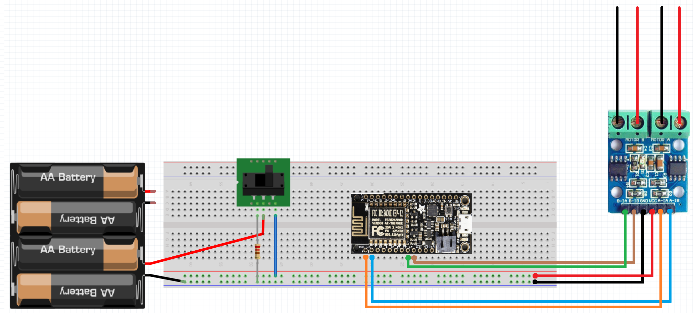

# nodebots

A work in progress.

# Software requirements
 - [Arduino IDE](https://www.arduino.cc/en/Main/Software), v. 1.6.4 or greater
 - [git](https://git-scm.com/)
 - [node](https://nodejs.org/en/) with npm v3 or greater

# Instructions

## Wire up the bot

.JPG)

1. Assemble the chassis kit. *Hint: You can bend the red and black motor wire ends into hooks that will stay on the motors without solder for testing purposes.*
2. Affix the free ends of the motor wires to the screw terminals in the H-bridge (red-black-red-black). Feed the wires through the holes in the chassis to secure them.
3. Gently plug the Feather board into the breadboard.
4. Attach six female-male jumper wires to the other end of the H-bridge. Connect the two pins labeled motor A to the Feather's pin 4 and pin 12. Connect the two pins labeled motor B to the Feather's pin 5 and pin 14. Connect H-bridge GND to the ground rail of the breadboard. Connect H-bridge VCC to the power rail of the breadboard. 
5. Use a male-male jumper to connect the breadboard ground rail to the GND pin of the Feather.
6. Add 4 AA batteries to the battery holder and plug the red wire into the power rail and the black wire into the ground rail. *Hint: You might want to leave the red wire unplugged until you're ready to drive the car in lieu of an on/off switch..*
7. *Optional: Add an on/off switch to your bot by following the circuit diagram below*
8. Use a ziptie to hold the breadboard, battery pack, and USB charger (to be plugged in later) to the chassis platform.



## Setting up the Feather HUZZAH with Johnny-Five and WiFi communication
 7. [Download](https://www.silabs.com/products/mcu/Pages/USBtoUARTBridgeVCPDrivers.aspx) and install the USB driver for your OS.
 8. Follow only Step 1 and Step 2 on [this website](http://www.samjulien.com/johnny-feather/). In Step 2, you may need to change the git command to ``git clone https://github.com/firmata/arduino.git ~/Documents/Arduino/libraries/Firmata``. *Hint: Be sure that your laptop and the device are connecting to the same WiFi SSID.*
 9. Disconnect the Feather from computer and attach USB power bank to micro USB port on the Feather.
 
## Downloading the code to control your bot
 10. Clone this repo to your local machine (``git clone https://github.com/hxlnt/feather-nodebot.git``).
 11. ``cd feather-nodebot``
 12. ``npm install``
 
## Registering your device on the Azure IoT dashboard 
 13. ``npm install -g iothub-explorer``
 14. ``iothub-explorer login "HostName=huzzahbots.azure-devices.net;SharedAccessKeyName=iothubowner;SharedAccessKey=SHARED_ACCESS_KEY_GOES_HERE"`` (Replace ``SHARED_ACCESS_KEY_GOES_HERE`` with the shared access key provided to you separately.)
 15. ``iothub-explorer create my-cool-device-name --connection-string`` where ``my-cool-device-name`` is whatever you want your device to be called. Take note of this name as well as the primary key returned back from the command line tool.
 16. Update index.js to contain your device's ID (name), primary key, and IP address (from Step 2 above).
 
## Drive your bot all around town!
 17. ``node index.js``
 18. You should see an output similar to this one upon a successful connection:
```
1481283325844 Device(s) Firmata
1481283345878 Connected Firmata
1481283369317 Repl Initialized
>> STAHP
Client connected
```
Inside the Node.js command prompt, use the keyboard keys up, right, and left to drive the car. Press the space bar to stop the car. Press q to quit.

## Coming soon: Link to the Azure IoT dashboard, where you can see a visualization of the motion and stats of all cars.
